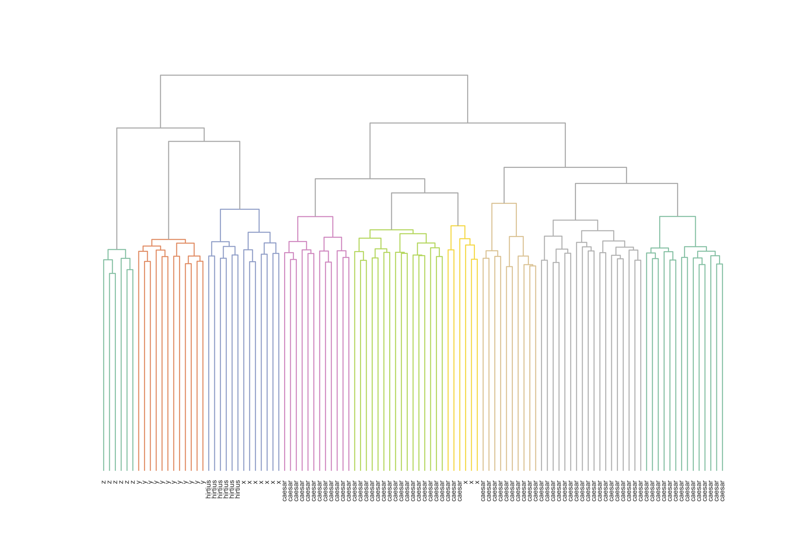

# Ružička: Authorship Verification in Python

    

## Introduction
The code in this repository offers an implementation of a number of routines in authorship studies, with a focus on authorship verification in the General Impostor (GI) framework. It specifically aimed to compare the fairly novel "minmax" measure (introduced by M. Ružička) to a number of popular alternatives. The packages additionally offers a number of useful implementations of common vector space models and evaluation metrics. The code in this repository was used to produce the results in a paper which is currently under submission.

## Quickstart
While the code in this repository was tailored towards our needs for a specific paper, we will include an IPython notebook, which will guide you through some of the main functionality offered. In the code, we try to offer full documentation in the form of docstrings.

## Data sets
This repository includes 6 multilingual benchmark datasets for authorship verification (under `data/`), which were used as the official competition data in the 2014 track on authorship verification of the annual [PAN evaluation lab](http://www.uni-weimar.de/medien/webis/events/pan-14/pan14-web/) on uncovering plagiarism, authorship, and social software misuse. The [survey paper](http://www.uni-weimar.de/medien/webis/events/pan-14/pan14-papers-final/pan14-authorship-verification/stamatatos14-overview.pdf) by Stamatatos et al. provides detailed information on the provenance, structure and nature of these corpora (together with baselines figures etc.). The competition data for this competition covered the following text varieties:
* Dutch essays
* Dutch reviews
* English essays
* English novels
* Spanish articles
* Greek articles

Additionally, this repository includes a novel benchmark dataset for Latin authors from Antiquity (under `data/latin/`), which were mainly selected from the [Latin Library](http://www.thelatinlibrary.com/). This data set has a similar structure as the PAN corpora, distinguising between a set of development and test problems regarding authorship verification. 

## Dependencies
This code requires Python 2.7+ (Python 3 has not been tested). The repository is dependent on a number of well-known third-party Python libraries, including:
+ numpy
+ scipy
+ scikit-learn
+ matplotlib
+ seaborn

We recommend installing Continuum's excellent [Anaconda Python framework](https://www.continuum.io/downloads), which comes bundled with most of these dependencies. Additionally, this code integrates a number of [scripts by Vincent van Asch](http://www.cnts.ua.ac.be/~vincent/software.html) to statistically compare the output of different classifiers, using Approximate Randomization Testing (under `ruzicka/`: `art.py`, `combinations.py` and `confusionmatrix.py`).

